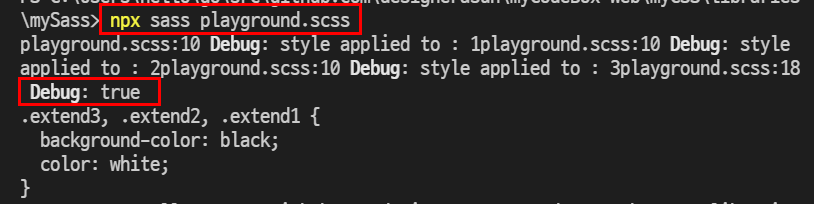
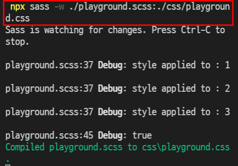
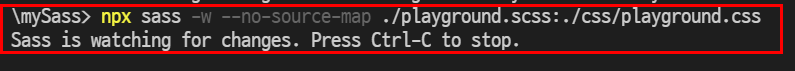

# Learning Sass essentials
## Installation
Install sass with npm. 

```shell
npm i -g sass
```

> When you install Sass on the command line, you'll be able to run the sass executable to compile .sass and .scss files to .css files.

```
Usage: sass <input.scss> [output.css]
       sass <input.scss>:<output.css> <input/>:<output/> <dir/>
```

For example:

```shell
# compile scss to css
$npx sass [inputDirectory/myInput.scss] [outputDirectory/myInput.css]

# set specific directories for input/output
$npx sass ./playground.scss ./css/playground.css
```

Once compiled, you can check result in terminal. 



### Watch mode
> --watch flag  acts like the --update flag, but after the first round compilation is done Sass stays open and continues compiling stylesheets whenever they or their dependencies change.

> Sass watches only the directories that you pass as-is on the command line, parent directories of filenames you pass on the command line, and load paths. It does not watch additional directories based on a file’s @import/@use/ @forward rules.



### No source map
> If the --no-source-map flag is passed, Sass won’t generate any source maps. it cannot be passed along with other source map options.




## Basics
> Sass is completely compatible with all versions of CSS. We take this compatibility seriously, so that you can seamlessly use any available CSS libraries.

> CSS on its own can be fun, but stylesheets are getting larger, more complex, and harder to maintain. This is where a preprocessor can help. Sass has features that don't exist in CSS yet like nesting, mixins, inheritance, and other nifty goodies that help you write robust, maintainable CSS.

> Once Sass is installed, you can compile your Sass to CSS using the sass command. You'll need to tell Sass which file to build from, and where to output CSS to.

### Module
> You don't have to write all your Sass in a single file. You can split it up however you want with the @use rule. This rule loads another Sass file as a module, which means you can refer to its variables, mixins, and functions in your Sass file with a namespace based on the filename. Using a file will also include the CSS it generates in your compiled output!

```scss
// _base.sass
$font-stack: Helvetica, sans-serif
$primary-color: #333

body
  font: 100% $font-stack
  color: $primary-color
```

And use this _base.sass like below. 

```scss
// styles.scss
@use 'base';

.inverse {
  background-color: base.$primary-color;
  color: white;
}
```

### Mixins
> Some things in CSS are a bit tedious to write, especially with CSS3 and the many vendor prefixes that exist. A mixin lets you make groups of CSS declarations that you want to reuse throughout your site. It helps keep your Sass very DRY.

```scss
@mixin theme($theme: DarkGray) {
  background: $theme;
  box-shadow: 0 0 1px rgba($theme, .25);
  color: #fff;
}

.info {
  @include theme;
}
.alert {
  @include theme($theme: DarkRed);
}
.success {
  @include theme($theme: DarkGreen);
}
```

> We're also using the variable $theme inside the parentheses so we can pass in a theme of whatever we want.

### Operator
> Doing math in your CSS is very helpful. Sass has a handful of standard math operators like +, -, *, math.div(), and %. In our example we're going to do some simple math to calculate widths for an article and aside.

```scss
@use "sass:math";

.container {
  display: flex;
}

article[role="main"] {
  width: math.div(600px, 960px) * 100%;
}

aside[role="complementary"] {
  width: math.div(300px, 960px) * 100%;
  margin-left: auto;
}
```

Sass supports various operators. 

1. == and != are used to check if two values are the same.
1. +, -, *, /, and % have their usual mathematical meaning for numbers, with special behaviors for units that matches the use of units in scientific math.
1. <, <=, >, and >= check whether two numbers are greater or less than one another.
and, or, and not have the usual boolean behavior. Sass considers every value “true” except for false and null.
1. +, -, and / can be used to concatenate strings.

### Parentheses
> You can explicitly control the order of operations using parentheses. An operation inside parentheses is always evaluated before any operations outside of them. Parentheses can even be nested, in which case the innermost parentheses will be evaluated first.

### Built-in module
> Sass provides many built-in modules which contain useful functions (and the occasional mixin). These modules can be loaded with the @use rule like any user-defined stylesheet, and their functions can be called like any other module member. All built-in module URLs begin with sass: to indicate that they're part of Sass itself.

> Before the Sass module system was introduced, all Sass functions were globally available at all times. Many functions still have global aliases (these are listed in their documentation). The Sass team discourages their use and will eventually deprecate them, but for now they remain available for compatibility with older Sass versions and with LibSass (which doesn’t support the module system yet).

```scss
@use "sass:color";

.button {
  $primary-color: #6b717f;
  color: $primary-color;
  border: 1px solid color.scale($primary-color, $lightness: 20%);
}
```

1. The sass:math module provides functions that operate on numbers.

1. The sass:string module makes it easy to combine, search, or split apart strings.

1. The sass:color module generates new colors based on existing ones, making it easy to build color themes.

1. The sass:list module lets you access and modify values in lists.

1. The sass:map module makes it possible to look up the value associated with a key in a map, and much more.

1. The sass:selector module provides access to Sass’s powerful selector engine.

1. The sass:meta module exposes the details of Sass’s inner workings.

## Free code camp exercise
Took below course and summarized essentials. 

- [Free code camp - Sass](https://www.freecodecamp.org/learn/front-end-development-libraries/#sass)

Sass can be called CSS having Javascript-like features. 

Install Sass through npm. 
```shell
$npm install -g sass 
$npm install sass --save
```

## Table of Contents 
- Variable 
- Nesting
- Mixin 
- Conditional : @if @else if @else
- Iteration : @for, @while, @each
- Partial : importing modules
- Extend

### Variable
In sass, you can declare and assign variable just like Javascipt. The variable is defined with '$'.

```scss
$heading-color : lightblue;
```

Use it like below. Using variable in sass gives us an advantage to improve code reusability.

```scss
$text-color : red;

h1, p, .content { 
    color : $text-color;
}
```

### Nesting
As a project is getting bigger, CSS lines will be more larger. Sass helps this with enabling **nesting CSS rules**. For example, **child** style rules can be nested in **parent** element in Sass. 

```Scss
$bg-color : beige;
$paragraph-color : gray; 

body {
    background-color : $bg-color;
    font-size: 2rem; 
    .intro {
        color : $paragraph-color;

        .title {
            width : 100%;
        }
    }
}
```

### Mixin
A mixin is a group of CSS declarations for reusability. Consider the mixin as a function in CSS. Useful to **remove repetition** when writing vendor prefix rules. 

```scss
// mixin declaration
@mixin (custom name) (parameters) // parameters are optional
@mixin hello-mixin ($color, $font-size) {
    color : $color;
    font-size : $font-size;
}

// mixin called with @include
.myMixIn {
    @include hello-mixin (red, 2rem); 
}
```

### Contional statement
If and else statement works in Sass just like they do in Javascript. **Do not add parenthesis** for conditions. For example, 

```scss
// Incorrect
@if ($param == 1) { 
    font-size : 1rem; 
}

// Correct
@if $param == 1 {
    font-size : 1rem;
}
```
### For, Each, and While
#### For
Add styles in a loop through for directive in Sass. 

```scss
@for (variable) from start to/through end { SCSS rules }
```

For loop in Sass has two ways : 
- from (start) through (end) : including end
- from (start) to (end) : excluding end

```scss
// syntax : CSS tag + #{$variable}
@for $i from 1 through 12 { 
    // calculated class name and width with sass for statement
    .col-#{$i} { 
        width : 100%/12 * $i; 
    }
}
```

#### Each
Sass also provides **@each** directive, which **iterates over each item** in a list or map. 

In the case of a list, 
```scss 
@each $size in 1rem, 2rem, 3rem {
    .myFontSize-#{$size} { 
        font-size : $size;
    }
}

```

In the case of a map, declare the **map as varaible** first and then **call key and value** in @each directive

```scss
$colorList : (1: red, 2: blue, 3: green); 

@each $key, $color in $colorList { // note that key and value both called
    .myColor-#{$color} {
        color : $color;
    }
} 
```

#### While
Creates CSS rules until a certain condition is met. 

```scss
$x : 1; 
@while $x < 6 {
    .div-#{$x} { 
        margin : 10px + $x;
    }
    $x : $x + 1; 
}

```

## Partial
Partial is **a Sass module** that can be imported to other Sass files. 
Simply prefix underscore to your partials then Sass will understand it is a module and **won't convert it into CSS**. 

```scss
_myMixin.scss
```

Import above partial with @import. Once the partial is imported, all the mixins and variables can be approached. **Should not include underscore** when importing a partial

```scss
@import 'myMixin'
```

### Extend
Extending in Scss enables easily **scale a style** to another element, **copying properties from source and add a new style** to scale the style.  

```scss
.info {
    width: 200px;
    border: 1px solid black;
    margin: 0 auto;
}
.info-important { 
    @extend .info;
    background-color : magenta;
}
```

## Reference
- [Free code camp - Sass](https://www.freecodecamp.org/learn/front-end-development-libraries/#sass)