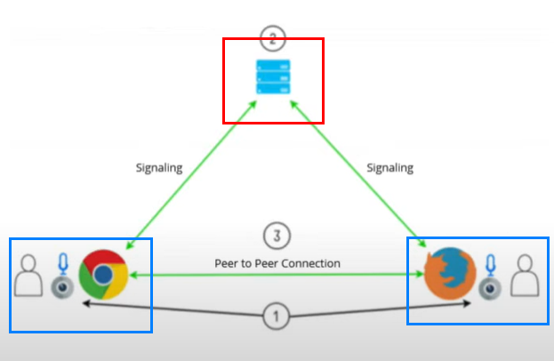

# Learning Web RTC essentials
> With WebRTC, you can add **real-time communication capabilities** to your application that works on top of an open standard. It supports video, voice, and generic data to be sent between peers, allowing developers to **build powerful voice- and video-communication solutions**. The technology is available on all modern browsers as well as on native clients for all major platforms. 

> The technologies behind WebRTC are implemented as an open web standard and **available as regular JavaScript APIs in all major browsers**. For native clients, like Android and iOS applications, a library is available that provides the same functionality. The WebRTC project is open-source and supported by Apple, Google, Microsoft and Mozilla, amongst others. This page is maintained by the Google WebRTC team.

> There are many different use-cases for WebRTC, from basic web apps that uses the camera or microphone, to more advanced video-calling applications and screen sharing. We have gathered a number of code samples to better illustrate how the technology works and what you can use it for.

## WebRTC Javascript API 
Built-in WebRTC Javascript API is as follows

- getUserMedia
- RTCPeerConnection
- dataChannel

WebRTC connects different types of browsers by signaling server. 

The signaling server is not a part of Web RTC standard implementation, meaning you should exploit third party tool such as websoket.

Once RTC connection is established bewteen hosts, a browser sends an offer and receives answer from another host through signaling server.

## ICE framework
> ICE is a framework that allows WebRTC to overcome the complexities of real-world networking. It’s ICE’s job to find the best path to connect peers. It may be able to do that with a direct connection between the clients, but it also works for clients where a direct connection is not possible (i.e. behind NATs).

- STUN server : used to get an external(public) network address
- TURN server : used to relay traffic if direct peer to peer connection fails

## Reference 
- [Web RTC](https://webrtc.org/)
- [WebRTC and VoIP WebRTC.Ventures course](https://youtube.com/playlist?list=PLayYqdnyegt0qX8EfEGExxZF3DxkyA1Dj)